# 🚀 SpaceX Launch Explorer

A modern React Native mobile application that provides real-time access to SpaceX launch data, interactive maps, and comprehensive mission information.

## 📱 About the Project

SpaceX Launch Explorer is a feature-rich mobile app that allows space enthusiasts to:

- Browse and search SpaceX launches with infinite scroll
- View launchpad locations on interactive maps
- Get detailed mission information and status updates
- Track distance from your location to launch sites
- Experience smooth, professional UI with modern design patterns

## ✨ Major Features

### 🚀 Launch Management

- **Infinite Scroll Pagination** - Load launches dynamically as you scroll
- **Real-time Search** - Filter launches by mission name with debounced input
- **Comprehensive Launch Details** - Mission patches, dates, status, and descriptions
- **Launch Status Tracking** - Upcoming, successful, failed, and other mission states

### 🗺️ Map Implementation

- **Native Maps Integration** - React Native Maps for cross-platform support
- **Launchpad Markers** - Interactive markers with launchpad information
- **User Location Tracking** - Real-time location with permission handling
- **Distance Calculations** - Haversine formula for accurate distance measurements
- **External Navigation** - Open Google Maps/Apple Maps for directions
- **Fallback UI** - Graceful handling when native maps aren't available

### 🎨 User Experience

- **Modern Design System** - Consistent colors, typography, and spacing
- **Smooth Animations** - Loading states, transitions, and micro-interactions
- **Responsive Layout** - Optimized for all screen sizes and orientations
- **Error Handling** - Comprehensive error boundaries and user feedback
- **Pull-to-Refresh** - Easy data refresh with visual feedback

## 🛠️ Tech Stack & Libraries

### Core Framework

- **React Native** - Cross-platform mobile development
- **Expo SDK 53** - Development platform and tools
- **TypeScript** - Type safety and better development experience

### Navigation & State

- **React Navigation v6** - Tab and stack navigation
- **Zustand** - Lightweight state management
- **React Native Safe Area Context** - Safe area handling

### Maps & Location

- **React Native Maps** - Native map components
- **Expo Location** - Location services and permissions
- **Haversine Formula** - Accurate distance calculations

### Data & Networking

- **Axios** - HTTP client with interceptors
- **SpaceX API v5** - Launches data (offset-based pagination)
- **SpaceX API v4** - Launchpad information

### UI & Styling

- **React Native Vector Icons** - Icon library (Ionicons)
- **StyleSheet** - Native styling with design system
- **Centralized Constants** - Colors, typography, spacing, shadows

### Development Tools

- **ESLint** - Code quality and consistency
- **Prettier** - Code formatting
- **Babel** - JavaScript compilation

## 🔐 Permission Flows & Handling

### Location Permissions

- **Android**: `ACCESS_FINE_LOCATION` permission request
- **iOS**: Location permission dialog with usage description
- **Graceful Fallback**: App works without location access
- **User Control**: Clear permission request with explanation

### Permission States

- **Granted**: Full location features enabled
- **Denied**: Map shows launchpad locations only
- **Limited**: Basic location features available
- **Never Ask**: User must enable in device settings

### Permission Request Flow

1. **Initial Request** - Clear explanation of why location is needed
2. **User Decision** - Accept or deny with option to ask later
3. **Fallback Handling** - App continues to function without location
4. **Settings Redirect** - Guide users to device settings if needed

## 📱 App Screenshots

### Android Screenshots
<div style="display: flex; flex-wrap: wrap; gap: 10px;">
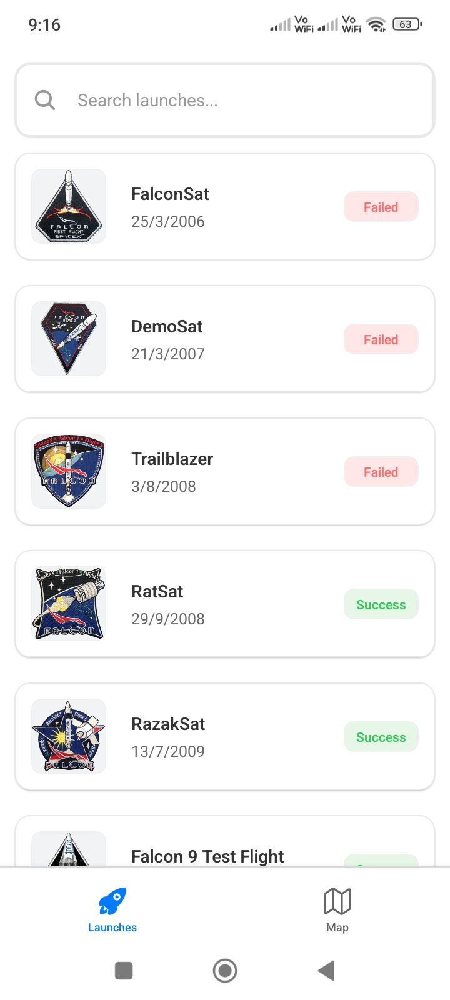
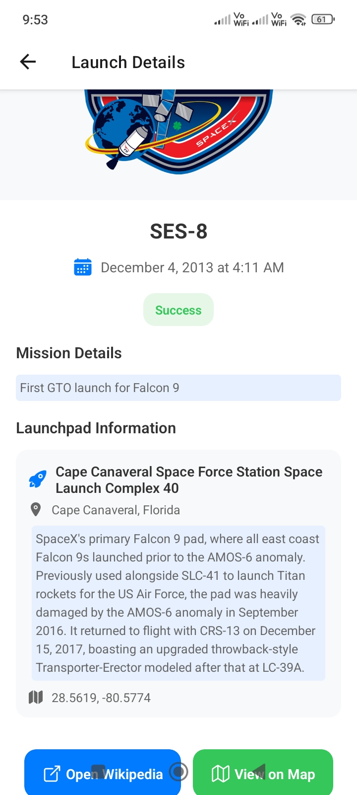
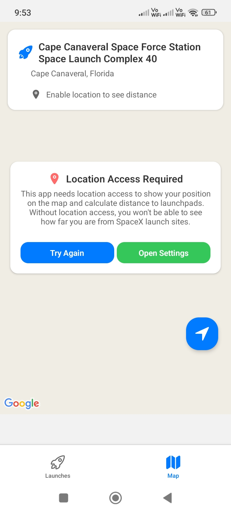
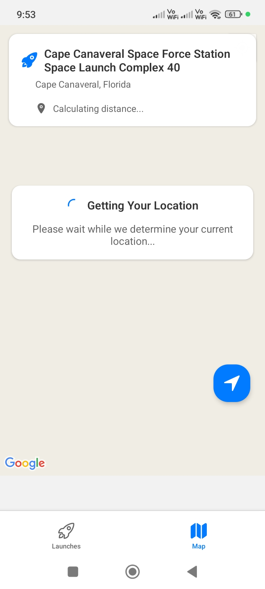
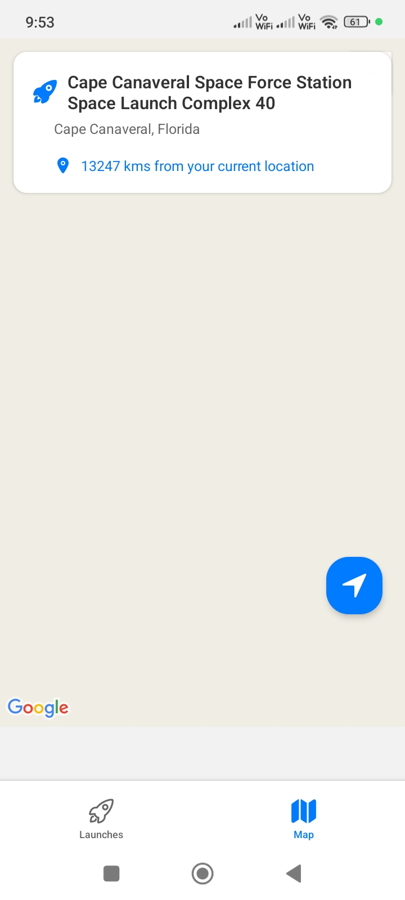
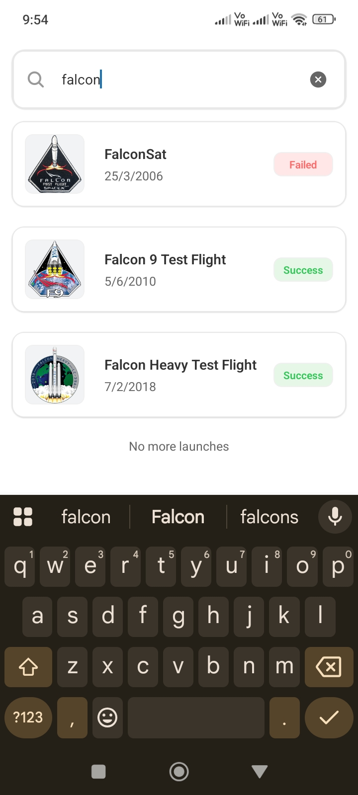
</div>

### iOS Screenshots
<div style="display: flex; flex-wrap: wrap; gap: 10px;">
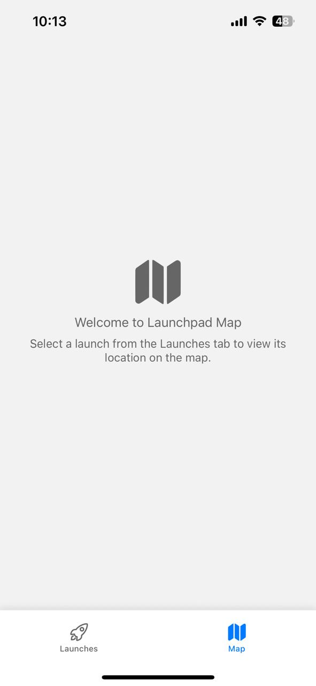
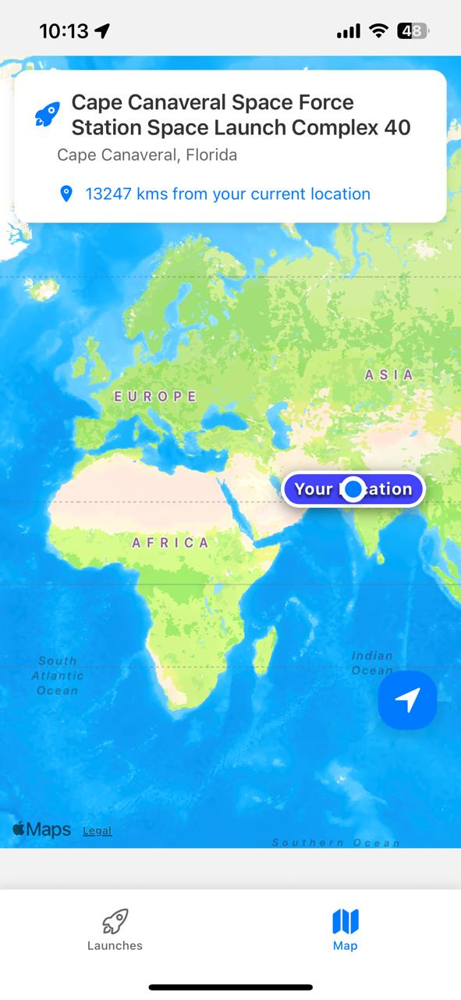
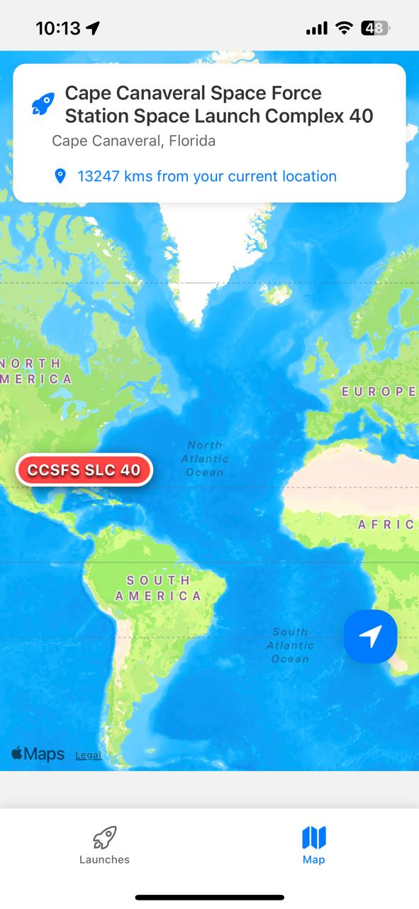
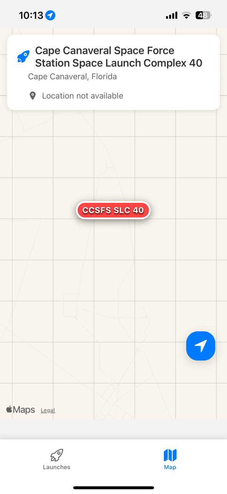
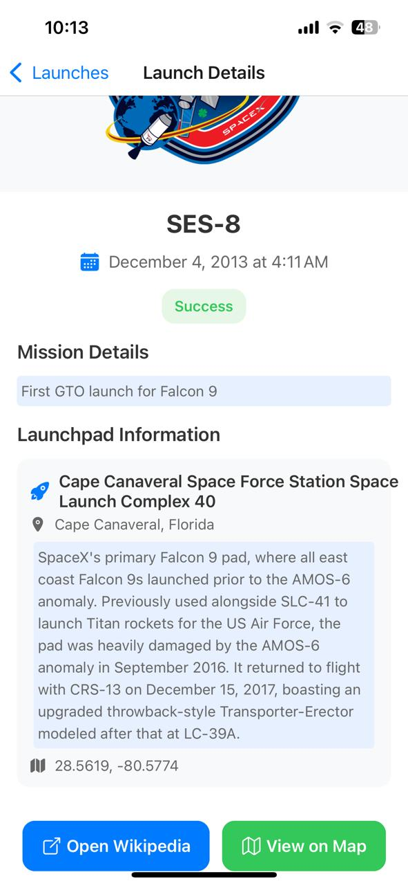
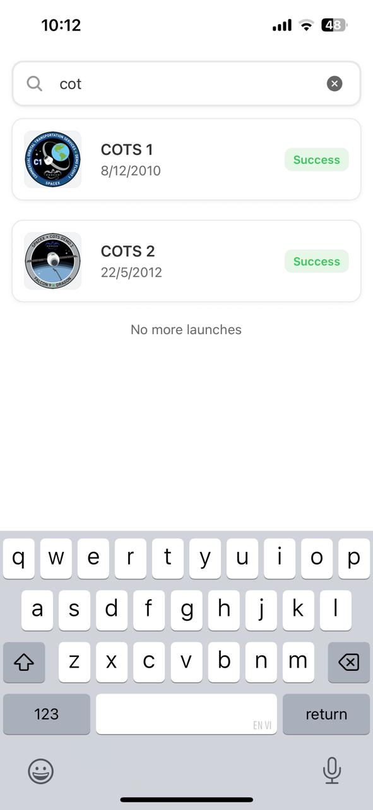
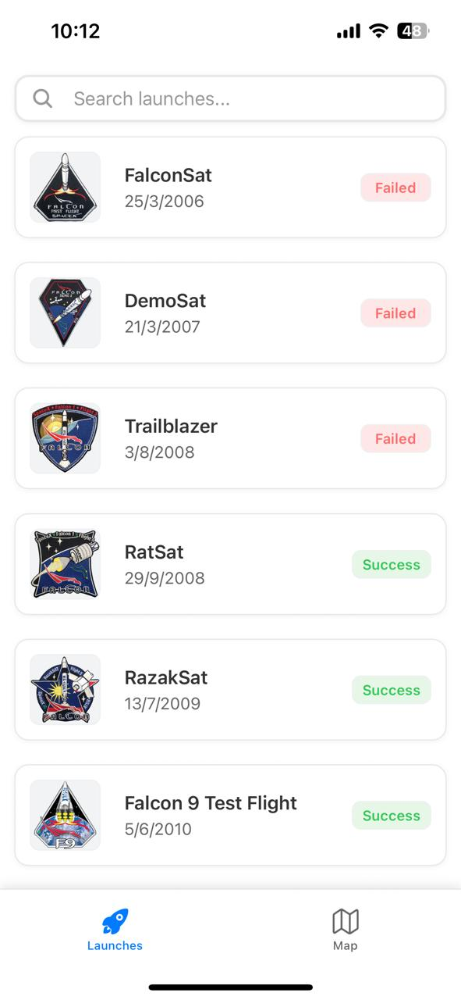
</div>

## 🏗️ Project Structure

```
src/
├── api/           # SpaceX API integration
├── components/    # Reusable UI components
├── hooks/         # Custom React hooks
├── navigation/    # Navigation configuration
├── screens/       # Main app screens
├── store/         # Zustand state management
└── utils/         # Utility functions and constants
```

## 🚀 Getting Started

### Prerequisites

- Node.js (v16+)
- npm or yarn
- Expo CLI
- iOS Simulator or Android Emulator

### Installation

```bash
git clone https://github.com/its221b/spacex-launch-explorer.git
cd spacex-launch-explorer
npm install
npm start
```

### Development

- **Expo Go**: Test on physical devices
- **Development Build**: Required for native maps
- **Hot Reload**: Instant code updates during development

## 📄 License

This project is open source and available under the MIT License.
